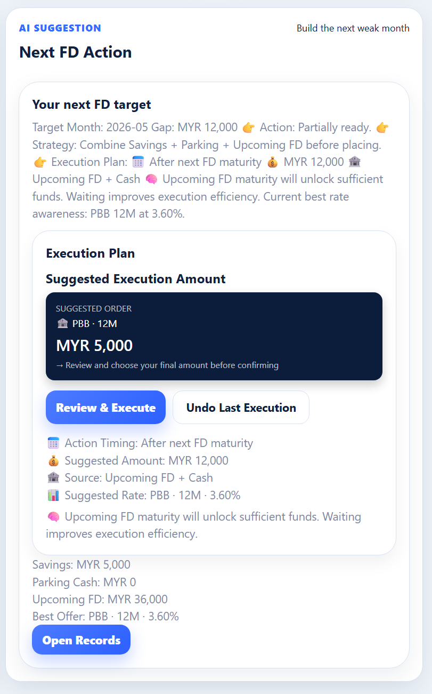
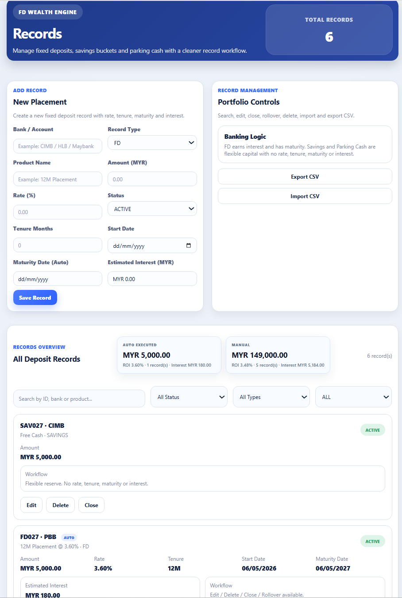
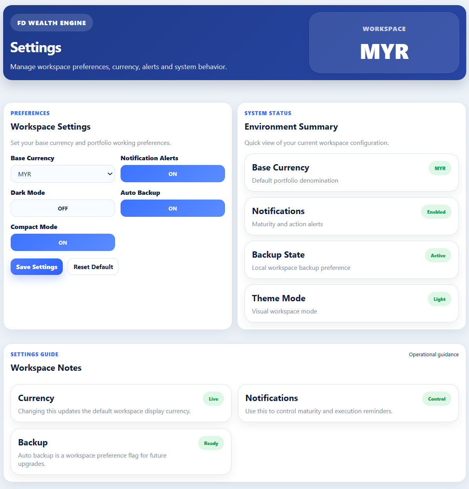

# 💰 FD Wealth Engine

**Private Banking Console for Fixed Deposit Portfolio Management**

Desktop Private Banking Console built with React, Vite and Electron.

---

## 🏦 Overview

FD Wealth Engine is a desktop-based financial management system designed to transform traditional Fixed Deposit (FD) tracking into a structured, intelligent portfolio system.

It enables users to manage, plan, and execute FD ladder strategies with clarity — similar to tools used in private banking environments.

---

## ✨ Key Features

### 📊 Portfolio Dashboard
- Total FD portfolio overview
- Savings & Parking Cash tracking
- Deployable funds visibility
- Monthly maturity insights

---

### ⚙️ Execution Engine (V32)
- Generate Execution Plan
- Confirm before execution
- Auto-create FD records
- Smart fund deduction from:
  - Savings
  - Parking Cash

---

### 🧠 Ladder Planning System
- Target month optimization
- Weak month detection
- Execution timing suggestions
- Partial build strategy

---

### 💼 Record Management
- Add / Edit / Delete FD
- Close & Rollover actions
- Auto-generated FD entries
- Clean separation:
  - FD
  - Savings
  - Parking Cash

---

### 🔔 Smart Workflow
- Execution confirmation modal
- Auto status tracking
- Real-time portfolio updates

---

## 🖥️ Screenshots

### 📊 Dashboard


---

### ⚙️ Execution Plan


---

### 💼 Records Management


---

### ⚙️ Settings Workspace


---

## ⚙️ Tech Stack

- **Frontend:** React + Vite
- **Desktop App:** Electron
- **State Management:** React Hooks
- **Storage:** LocalStorage

---

## 🚀 Getting Started

### Install Dependencies

```bash
npm install
```

### Run Development Server

```bash
npm run dev
```

### Build Desktop Application

```bash
npm run desktop:build
```

## 📦 Project Vision

FD Wealth Engine aims to modernize personal fixed deposit portfolio management by combining:

- Portfolio analytics
- Ladder planning
- Smart execution workflows
- Banking-style UI experience
- Intelligent deployment guidance

The long-term goal is to evolve the platform into a complete private banking style FD operating system for global multi-currency portfolio management.

## 📄 License

This project is for educational, portfolio and product development purposes.

