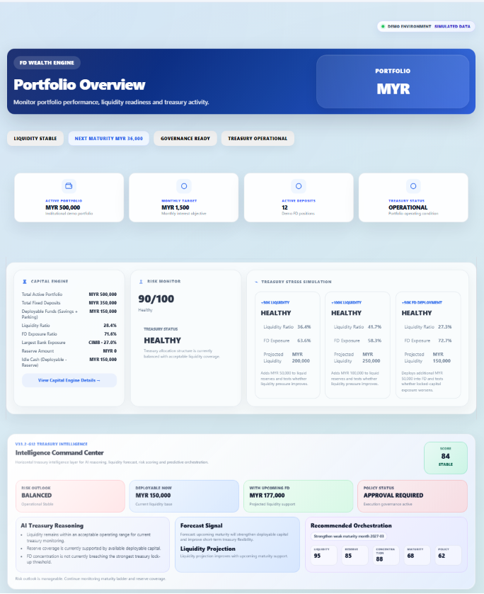
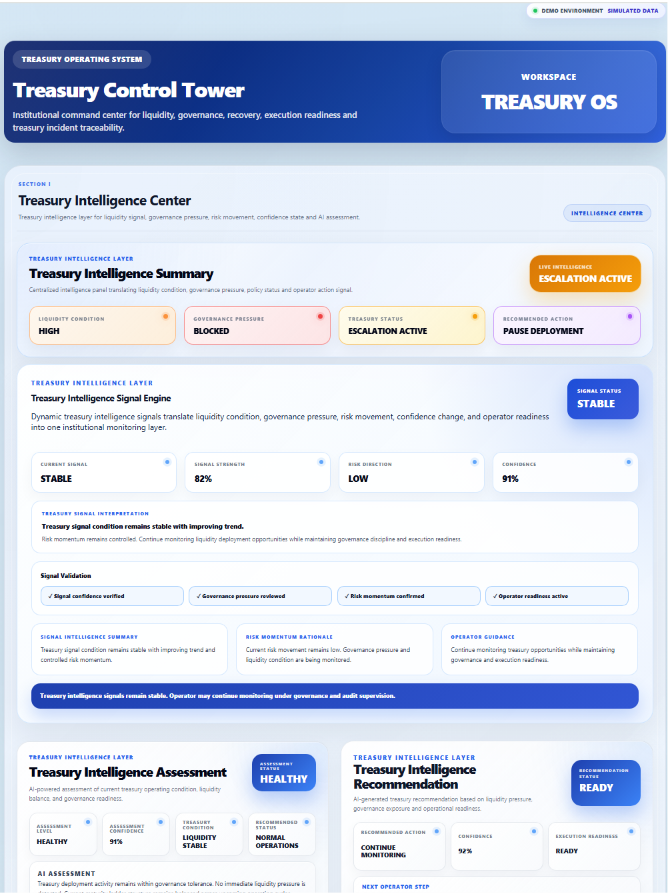
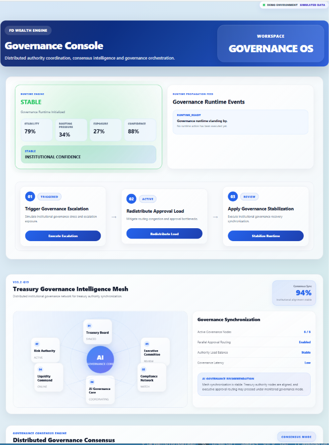
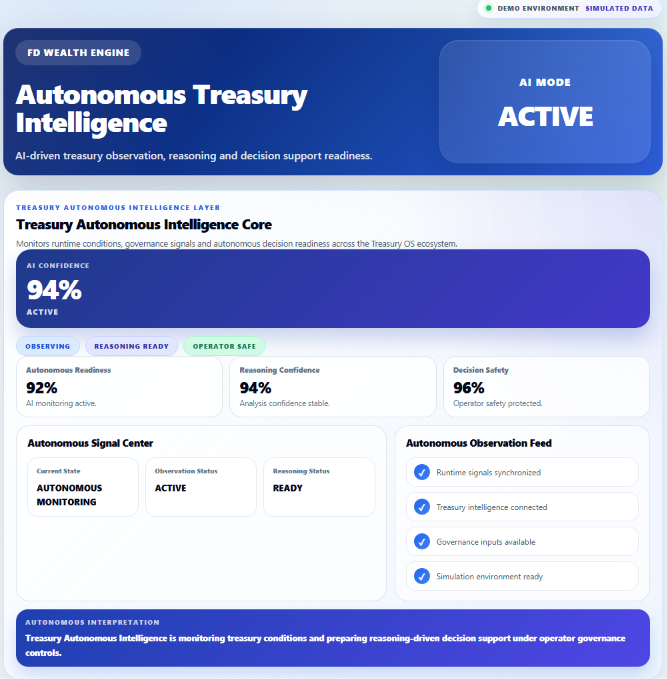

# FD Wealth Engine

## Treasury OS V1

**Institutional Treasury Intelligence Platform**

FD Wealth Engine has evolved from a Fixed Deposit portfolio tracker into **Treasury OS V1** — a desktop treasury operating system designed for portfolio visibility, treasury operations, governance coordination, runtime monitoring and autonomous intelligence readiness.

Built with **React, Vite and Electron**.

---

## Overview

Treasury OS V1 provides a unified operating environment for monitoring capital, coordinating treasury workflows, observing system health and supporting governance-driven decision making.

The platform is designed to help users move beyond basic portfolio tracking into a structured treasury intelligence workspace.

Core objectives:

- Monitor treasury capital and liquidity
- Track maturity visibility and deployment readiness
- Coordinate recovery, routing and escalation workflows
- Support governance mesh and authority synchronization
- Observe runtime health, stability and system readiness
- Prepare the foundation for autonomous treasury intelligence

---

## Core Capabilities

### Dashboard

Institutional treasury monitoring and portfolio supervision.

Features:

- Portfolio Overview
- Capital Intelligence
- Liquidity Visibility
- Maturity Intelligence
- Treasury Alerts
- Execution Snapshot
- Audit Trail
- Ledger Intelligence

---

### Treasury Console

Treasury operations, recovery orchestration and execution coordination.

Features:

- Treasury Command Center
- Recovery Queue Management
- Treasury Routing Engine
- Incident Timeline
- Recovery Intelligence
- Escalation Management
- Authority Chain
- Transmission Network

---

### Governance Console

Distributed authority coordination and governance orchestration.

Features:

- Governance Mesh
- Consensus Intelligence
- Conflict Resolution
- Governance Latency Intelligence
- Authority Load Balancing
- Parallel Approval Routing
- Governance Decision Matrix
- Executive Authority Coordination

---

### Autonomous Intelligence

AI-assisted treasury observation and decision support readiness.

Features:

- Autonomous Treasury Intelligence Core
- Runtime Observation
- Reasoning Readiness
- Decision Safety Monitoring
- Governance Awareness
- Treasury Intelligence Integration

---

### Treasury Documentation System

Built-in institutional documentation environment.

Includes:

- Treasury Manual V1
- Governance Manual V1
- User Onboarding Guide V1
- Multi-language Documentation Framework

---

## Treasury OS Architecture

```text
Dashboard
    ↓
Treasury Console
    ↓
Governance Console
    ↓
Treasury Intelligence Layer
    ↓
Strategy Intelligence Layer
    ↓
Runtime Intelligence Layer
    ↓
Autonomous Intelligence Layer
```

Treasury OS is designed as a layered institutional operating environment where treasury operations, governance coordination and intelligence systems operate together as a unified platform.

---

## Intelligence Systems

### Treasury Intelligence Layer

Provides:

- Signal Analysis
- Assessment Intelligence
- Recommendation Engine
- Decision Intelligence
- Execution Intelligence
- Feedback Intelligence
- Learning Intelligence
- Predictive Intelligence

---

### Treasury Strategy Intelligence Layer

Provides:

- Capital Allocation Intelligence
- Portfolio Optimization
- Scenario Planning
- What-If Analysis
- Future State Modeling

---

### Treasury Runtime Intelligence Layer

Provides:

- Runtime Monitoring
- Runtime Alerts
- Runtime Escalation
- Runtime Response Intelligence
- Runtime Recovery Intelligence
- Runtime Stability Intelligence
- Treasury OS Health Monitoring

---

## Workspace Modes

Treasury OS supports two operating modes.

### Live Mode

Production treasury environment using actual portfolio data.

### Demo Mode

Demonstration environment for product showcases, testing, walkthroughs and release presentations.

---

## Screenshots

> Screenshot assets should be placed inside the repository `assets/` folder.

### Dashboard

Treasury portfolio monitoring, capital intelligence and treasury visibility.



---

### Treasury Console

Treasury operations, intelligence orchestration and command center monitoring.



---

### Governance Console

Governance mesh coordination, consensus intelligence and authority synchronization.



---

### Autonomous Intelligence

AI-assisted treasury observation, reasoning readiness and decision support monitoring.



---

## Technology Stack

### Frontend

- React
- Vite

### Desktop Platform

- Electron

### State Management

- React Hooks
- Local component state
- LocalStorage persistence

### Data Storage

- LocalStorage

### Styling

- Modular CSS Architecture
- Treasury-specific styling layers
- Documentation styling system

---

## Getting Started

### Install Dependencies

```bash
npm install
```

### Run Development Environment

```bash
npm run dev
```

Default local development server:

```text
http://localhost:5173
```

### Build Desktop Application

```bash
npm run desktop:build
```

---

## Project Structure

```text
fd-app/
├── src/
│   ├── components/
│   ├── pages/
│   ├── styles/
│   ├── utils/
│   ├── App.jsx
│   └── main.jsx
│
├── public/
├── package.json
├── vite.config.js
└── README.md
```

---

## Documentation

Treasury OS includes integrated documentation pages inside the application.

### Treasury Manual V1

Institutional treasury operating procedures and architecture overview.

### Governance Manual V1

Governance mesh, authority coordination and decision framework.

### User Onboarding Guide V1

First-time user guidance and platform walkthrough.

---

## Current Release Status

### Version

**V33.2 Treasury OS V1**

### Release Type

**Documentation Release Candidate**

### Repository

```text
fd-wealth-engine-updates
```

### Latest Stable Milestones

* RP1 Workspace Foundation
* RP2 Treasury Manual V1
* RP3 Governance Manual V1
* RP4 User Onboarding Guide V1
* RP5 GitHub README V1

### Target Release

**Treasury OS V1 Release Candidate**

### Next Phase

**Treasury OS V1 Official Release**

---

## Release Completion Status

### Completed

* Workspace Mode Foundation
* Demo Mode Integration
* Demo Dataset Cleanup
* Treasury Manual V1
* Governance Manual V1
* User Onboarding Guide V1
* Treasury OS Documentation Program
* GitHub README V1

### Next

* Treasury OS V1 Release Candidate
* Treasury OS V1 Official Release

---

## Roadmap

### Treasury OS V1

* Dashboard Intelligence
* Treasury Operations
* Governance Coordination
* Runtime Intelligence
* Autonomous Readiness
* Documentation System

### Future Development

* Multi-Currency Expansion
* Institutional Reporting
* Enhanced Autonomous Intelligence
* Treasury Automation
* Global Treasury Management
* Extended Asset Class Support

---

## Project Vision

Treasury OS aims to evolve beyond portfolio tracking into a complete treasury operating environment.

The platform combines:

* Treasury Visibility
* Governance Coordination
* Runtime Intelligence
* Strategic Planning
* Operational Monitoring
* Autonomous Readiness

to create a next-generation treasury management experience.

---

## Author

**Lai Wah Ho**

Built with:

* React
* Vite
* Electron

---

## Release Note

**Treasury OS V1 is currently in Documentation Release Candidate stage.**

This release candidate focuses on stabilizing the product documentation layer, GitHub presentation, onboarding flow and institutional architecture communication before the final Treasury OS V1 stable release.

---

## Treasury OS V1

**Institutional Treasury Intelligence Platform**

Documentation Release Candidate
